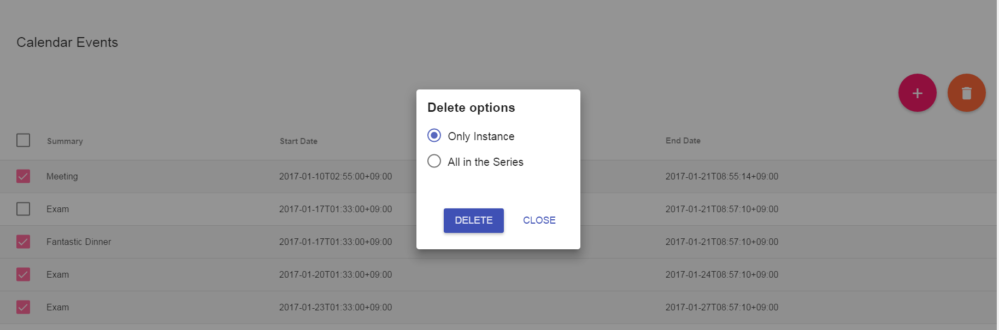
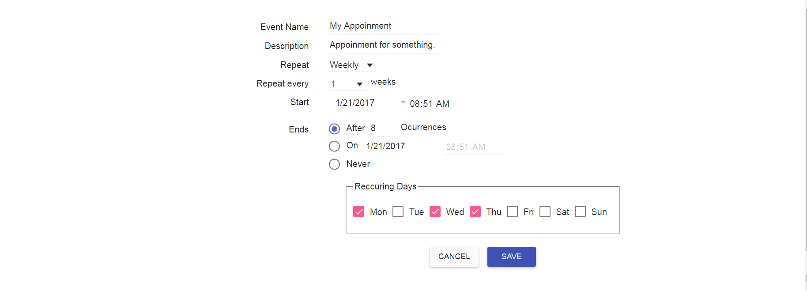

# Google Calendar App







## Installation & Run
```
npm install
bower install
npm start
```

View your browser at http://localhost:8080

## Configuration

#### config.js
```
siteURL=<your site url>
dbURL=<your mongodb url>
```

#### auth.js
```
clientID=<your google client ID>
clientSecret=<your google client Secret>
callbackURL=<google auth redirect url>
```

